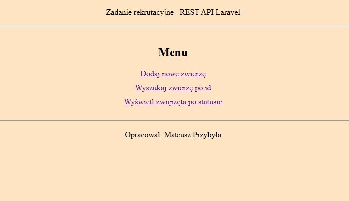
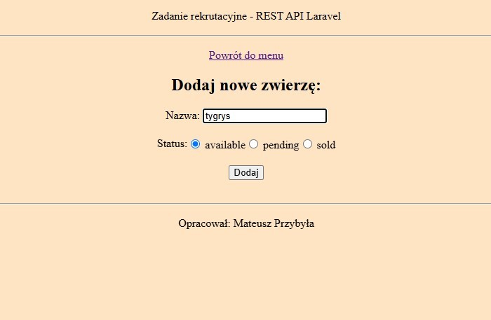
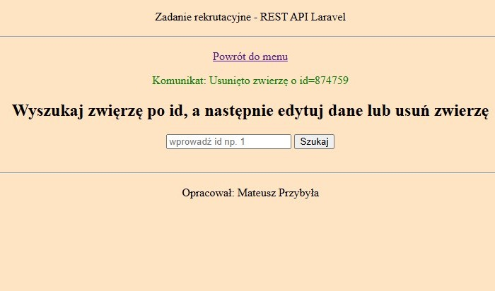

# REST API Laravel App

## Overview

Prosty interfejs do komunikacji z Swagger Petstore API.

Wymagania: operacje CRUD, czyli umożliwienie dodawania, pobierania, edytowania i usuwania elementów w zasobie /pet, wraz z obsługą błędów.

## How to start

Uruchom projekt lokalnie na swoim pc:

-   włącz XAMPP Control Panel oraz uruchom Apache serwer,
-   pobierz repozytorium na swój lokalny komputer do folderu /htdocs,

```bash
  git clone https://github.com/mateusz-przybyla/RestApiLaravelApp.git
```

-   zainstaluj wymagane zależności:

```bash
  composer install
```

-   nie ma konieczności konfigurowania pliku .env oraz połączenia z bazą danych,
-   będąc w katalogu projektu, uruchom aplikację lokalnie komendą:

```bash
  php artisan serve
```

-   otwórz przeglądarkę i uruchom stronę lokalnie: http://localhost:8000/

## Screenshots

-   Menu główne:



-   Formularz dodawania nowego zwierzęcia:



-   Komunikat informujący o dodaniu nowego zwierzęcia i przekierowanie na stronę, gdzie można wyszukać zwierzę:


-   Wynik wyszukiwania utworzonego zwierzęcia:


-   Formularz edycji danych zwierzęcia:


-   Komunikat informujący o edycji wybranego zwierzęcia:


-   Wynik wyszukiwania edytowanego zwierzęcia (zmieniono nazwę na: tygrys2 i status na: sold):


-   Komunikat informujący o usunięciu wybranego zwierzęcia:



-   Wynik wyszukiwania usuniętego zwierzęcia:


-   Możliwość wyświetlenia wszystkich dostępnych wyników po wybranym statusie:


## Built with

-   PHP, Laravel, HTML, CSS, JavaScript,
-   Composer - zarządzanie zależnościami.

## Useful resources

-   https://laravel.com/docs/12.x
-   https://petstore.swagger.io
